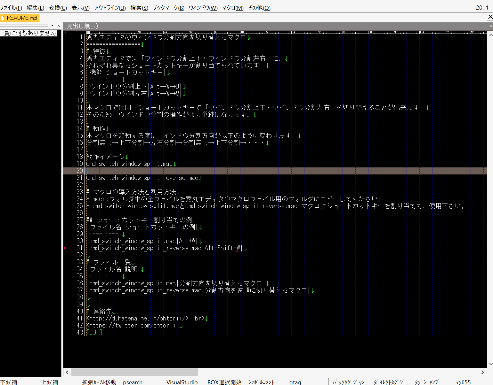
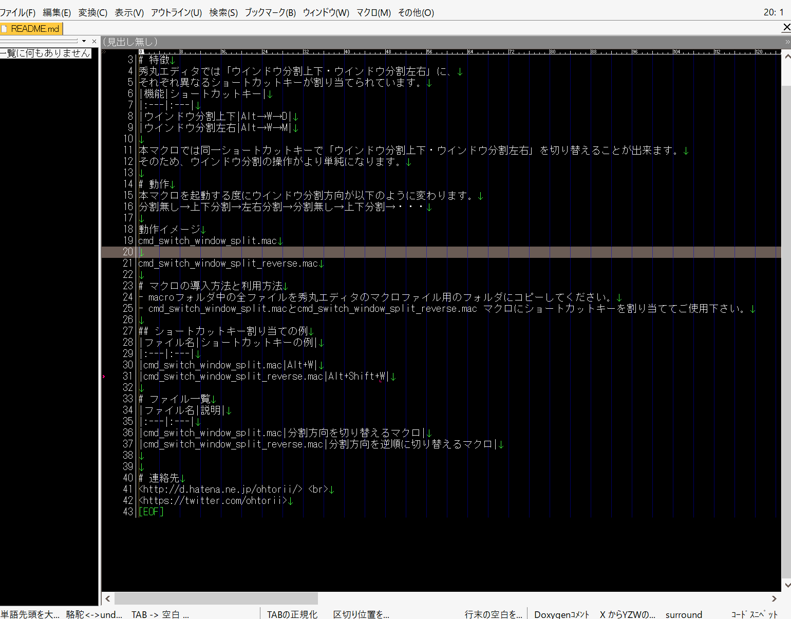

秀丸エディタのウインドウ分割方向を切り替えるマクロ
=================
# 特徴
秀丸エディタでは「ウインドウ分割上下・ウインドウ分割左右」に、
それぞれ異なるショートカットキーが割り当てられています。
|機能|ショートカットキー|
|:---|:---|
|ウインドウ分割上下|Alt→W→D|
|ウインドウ分割左右|Alt→W→M|

本マクロでは同一ショートカットキーで「ウインドウ分割上下・ウインドウ分割左右」を切り替えることが出来ます。
そのため、ウインドウ分割の操作がより単純になります。

# 動作
本マクロを起動する度にウインドウ分割方向が以下のように変わります。
分割無し→上下分割→左右分割→分割無し→上下分割→・・・

## 動作イメージ
### cmd_switch_window_split.mac

### cmd_switch_window_split_reverse.mac

# マクロの導入方法と利用方法
- macroフォルダ中の全ファイルを秀丸エディタのマクロファイル用のフォルダにコピーしてください。
- cmd_switch_window_split.macとcmd_switch_window_split_reverse.mac マクロにショートカットキーを割り当ててご使用下さい。

## ショートカットキー割り当ての例
|ファイル名|ショートカットキーの例|
|:---|:---|
|cmd_switch_window_split.mac|Alt+W|
|cmd_switch_window_split_reverse.mac|Alt+Shift+W|

# ファイル一覧
|ファイル名|説明|
|:---|:---|
|cmd_switch_window_split.mac|分割方向を切り替えるマクロ|
|cmd_switch_window_split_reverse.mac|分割方向を逆順に切り替えるマクロ|

# 動作環境
秀丸エディタ ver 8.00以降

# 連絡先
<http://d.hatena.ne.jp/ohtorii/>  
<https://twitter.com/ohtorii>
